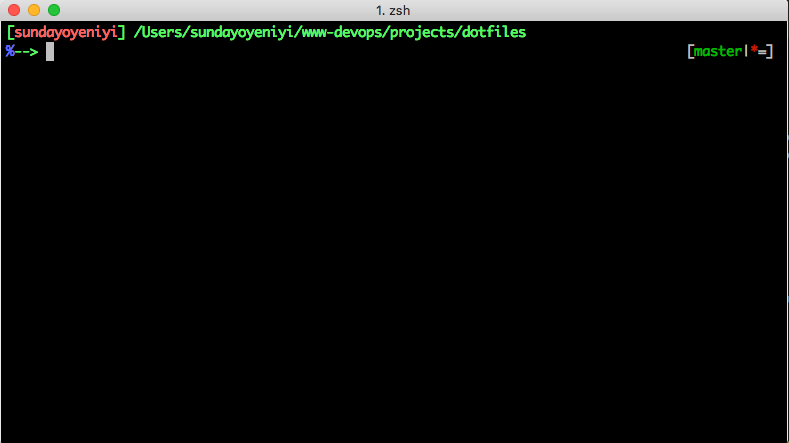

# .dotfiles

Personal dotfiles for macOS development. No Oh My Zsh — just plain Zsh configuration modules, Homebrew package management via Brewfile, WezTerm terminal config, and utility scripts.

## Structure

| Path | Purpose |
|------|---------|
| `Brewfile` | Declarative Homebrew package list (formulae + casks) |
| `zsh-config/` | Zsh configuration modules (sourced in order by `.zshrc`) |
| `symlinks/` | Symlink sources for `~/.zshrc`, `~/.gitignore`, `~/.vimrc` |
| `config/wezterm/` | WezTerm terminal configuration |
| `bin/` | Installer and update scripts |
| `post-install/` | Post-bootstrap setup (shell, Node, Java) |
| `updates/` | System update scripts |
| `assets/` | Screenshots |

## Quick start

```sh
git clone git@github.com:sundayoyeniyi/.dotfiles.git ~/.dotfiles
~/.dotfiles/bin/symlink_installer.sh    # symlink configs into $HOME
~/.dotfiles/bin/system_installer.sh --all   # install everything
```

Review the scripts first — they install the tools, languages, and apps I use daily.

## Package management

Packages are managed through a `Brewfile` at the repo root. To add or remove a Homebrew-managed package, edit `Brewfile` and re-run:

```sh
bin/system_installer.sh --all
```

For granular control:

```sh
bin/system_installer.sh --formula   # install/upgrade formulae only
bin/system_installer.sh --casks     # install/upgrade casks only
bin/system_installer.sh --python        # install/upgrade global python packages (uv tools)
bin/system_installer.sh --uninstall # remove deprecated packages
bin/system_installer.sh --info      # show pending changes
```

## Zsh configuration

`.zshrc` is a thin entry point that sources `zsh-config/*.zsh` in order:

- **Options** — Zsh settings (`autocd`, `CORRECT`, etc.)
- **Environment** — PATH entries for Homebrew, NVM, jenv, Anaconda, uv, Ollama, IntelliJ, Gradle
- **Completions** — Homebrew Zsh completions
- **Aliases** — Git, Gradle, Docker, IDE, and script shortcuts
- **Prompt** — Custom prompt with Git status via `__git_ps1`

Secrets and proxy settings go in `secrets.zsh` / `proxy_install.zsh` (templates provided, gitignored).

## WezTerm

Configuration lives in `config/wezterm/`. Features:

- Tokyo Night colour scheme, JetBrains Mono 18pt, ligatures
- Tab bar, pane splitting, workspace management
- Project launcher with workspace registry
- TradeAlpha workspace: 3-tab layout with Ollama, OpenCode, dev servers

## Symlinks

`bin/symlink_installer.sh` creates symlinks from the repo into `$HOME`:

| Source | Destination |
|--------|-------------|
| `symlinks/zshrc.symlink` | `~/.zshrc` |
| `symlinks/gitignore.symlink` | `~/.gitignore` |
| `symlinks/vimrc.symlink` | `~/.vimrc` |
| `config/wezterm/` | `~/.config/wezterm/` |

## Shell prompt



## Resources

- [ZSH](http://zsh.sourceforge.net)
- [holman dotfiles](http://zachholman.com/2010/08/dotfiles-are-meant-to-be-forked/)
- [dotfiles.github.io](https://dotfiles.github.io/)
